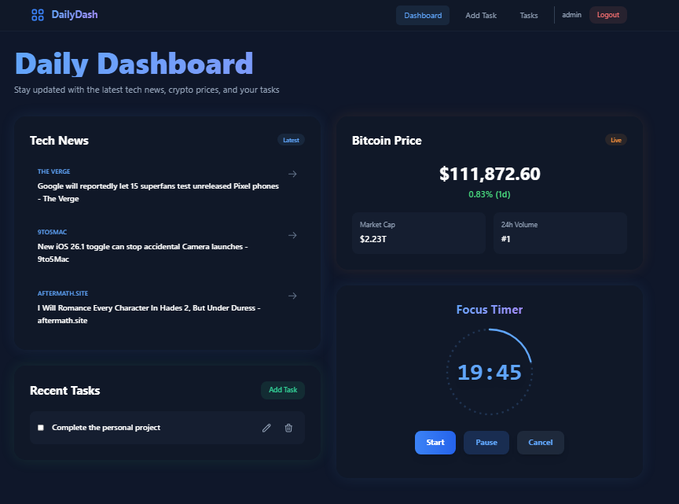

# DailyDash

A modern, glass-morphism themed daily dashboard web app built with Django.  
Features tech news aggregation, live Bitcoin price, Pomodoro timer, and personal task management.

## Features

- **User Authentication:** Register, login, logout, secure sessions.
- **Tech News:** Aggregates latest technology news headlines.
- **Bitcoin Price Widget:** Live price, market cap, and 24h volume (auto-updates via AJAX).
- **Task Management:** Add, update, delete, and mark tasks as done.
- **Pomodoro Timer:** Futuristic timer with start, pause, resume, and cancel; session saving.
- **Responsive UI:** Glass-morphism design, animated transitions, and dark theme.
- **Role-based Navbar:** Shows relevant links based on authentication status.

## Screenshots



## Getting Started

### Prerequisites

- Python 3.8+
- Django 4.x
- pip

### Installation

1. **Clone the repository:**
    ```bash
    git clone https://github.com/m1amineratit/Daily-dash.git
    cd dailydash
    ```

2. **Create and activate a virtual environment:**
    ```bash
    python -m venv venv
    source venv/bin/activate  # On Windows: venv\Scripts\activate
    ```

3. **Install dependencies:**
    ```bash
    pip install -r requirements.txt
    ```

4. **Apply migrations:**
    ```bash
    python manage.py migrate
    ```

5. **Create a superuser (optional):**
    ```bash
    python manage.py createsuperuser
    ```

6. **Run the development server:**
    ```bash
    python manage.py runserver
    ```

7. **Access the app:**
    - Open [http://localhost:8000](http://localhost:8000) in your browser.

## Usage

- Register a new account or login.
- View the dashboard for news, Bitcoin price, and your tasks.
- Add, edit, or delete tasks.
- Use the Pomodoro timer to focus and save sessions.
- Bitcoin price updates automatically every minute without page reload.

## Configuration

- **News API:** Update your News API key in `dashboard/views.py`.
- **Bitcoin Price:** Scrapes CoinMarketCap; for stability, consider switching to a public crypto API.

## Folder Structure

```
system/
├── dashboard/
│   ├── models.py
│   ├── views.py
│   ├── urls.py
│   └── templates/pages/
│       ├── dashboard.html
│       ├── tasks.html
│       ├── add_task.html
│       ├── update_task.html
├── account/
│   ├── views.py
│   └── templates/auth/
│       ├── login.html
│       └── register.html
├── templates/
│   └── base.html
├── static/
│   └── ...
├── manage.py
└── README.md
```

## Contributing

Pull requests are welcome!  
For major changes, please open an issue first to discuss what you would like to change.

## License

MIT License

---

**DailyDash** – Your productivity, news, and crypto dashboard.